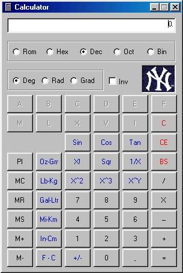



## Tim's Scientific Calculator 1\.01

### Description

This program is a Simple Scientific Calculator. It handles Roman Numeral, Hex, Decimal, Octal and Binary numbers. Degrees, Radians and Gradians. All the standard Trig functions. Factorial, Sqr, Inverse, Square, Cube, X^Y. Fun conversions like Ounce <-> Grams, Pounds <-> Kilograms, Gallon <-> Litre, Mile <-> Kilometer, Inch <-> Centimeter and Fahrenheight <-> Celsius
 
### More Info
 

             |
---                |---
**Submitted On**   |2004-12-13 14:46:16
**By**             |[Timothy C\. Alvord](https://github.com/Planet-Source-Code/PSCIndex/blob/master/ByAuthor/timothy-c-alvord.md)
**Level**          |Beginner
**User Rating**    |5.0 (10 globes from 2 users)
**Compatibility**  |VB 6\.0
**Category**       |[Complete Applications](https://github.com/Planet-Source-Code/PSCIndex/blob/master/ByCategory/complete-applications__1-27.md)
**World**          |[Visual Basic](https://github.com/Planet-Source-Code/PSCIndex/blob/master/ByWorld/visual-basic.md)
**Archive File**   |[Tim's\_Scie18289912132004\.zip](https://github.com/Planet-Source-Code/timothy-c-alvord-tim-s-scientific-calculator-1-01__1-57709/archive/master.zip)

